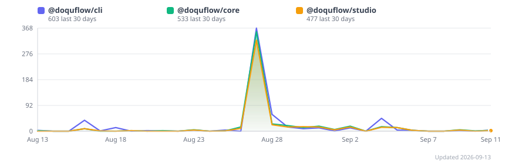

https://github.com/user-attachments/assets/e8e75f1e-9fcb-48ab-ae9d-29b14dea2212

# Docuflow

**Intent in, value out.** Docuflow is an MCP server that lets AI agents read a codebase and build a persistent, incrementally-maintained knowledge base — so context accumulates instead of being rediscovered on every query.

[](https://www.npmjs.com/package/@doquflow/cli)
[](https://www.npmjs.com/package/@doquflow/server)
[](https://www.npmjs.com/package/@doquflow/cli)
[](https://shaifulshabuj.github.io/docuflow-mcp/)



> 📖 **[Full documentation →](https://shaifulshabuj.github.io/docuflow-mcp/)** — installation, CLI reference, MCP tools, concepts and guides.

---

## The LLM Wiki pattern

Rather than re-extracting knowledge on every query, Docuflow keeps three layers:

| Layer | Where | Who writes it |
|---|---|---|
| **Raw sources** — immutable, kept as an audit trail | `.docuflow/sources/` | you |
| **Wiki** — entities, concepts, timelines, syntheses; cross-referenced and indexed | `.docuflow/wiki/` | the agent |
| **Schema and metadata** — structure, catalog, append-only operation log | `.docuflow/schema.md`, `index.md`, `log.md` | both |

The agent does the bookkeeping — cross-references, consistency, contradictions — once, and that work compounds. Ask the same question weeks later and the answer is better, because the wiki is richer. That is the difference from a RAG system that rediscovers everything each time.

[Concepts →](https://shaifulshabuj.github.io/docuflow-mcp/latest/concepts/llm-wiki-pattern/) · [Architecture →](https://shaifulshabuj.github.io/docuflow-mcp/latest/concepts/architecture/)

---

## Quickstart

```bash
npm install -g @doquflow/cli
cd your-project
docuflow init --interactive     # create .docuflow/, register the MCP server
```

Drop a document into `.docuflow/sources/`, then let your agent ingest and query it — or drive it yourself:

```bash
docuflow ingest auth-design.md  # fold a source into the wiki
docuflow query "How does authentication work?"
docuflow status                 # wiki health and counts
```

Keep the wiki current on your own machine, with no API keys:

```bash
docuflow sync --ai              # one-shot, auto-detects the AI bridge
docuflow watch --ai             # continuous background sync
```

[Installation →](https://shaifulshabuj.github.io/docuflow-mcp/latest/getting-started/installation/) · [Quickstart →](https://shaifulshabuj.github.io/docuflow-mcp/latest/getting-started/quickstart/) · [CLI reference →](https://shaifulshabuj.github.io/docuflow-mcp/latest/reference/cli/)

Migrating from v1.5? See [MIGRATION.md](MIGRATION.md).

---

## MCP tools

Docuflow registers 16 MCP tools across seven categories — legacy code extraction, source ingestion, wiki querying, maintenance, guidance, dependency analysis and context service. Agents auto-discover them via the generated `CLAUDE.md`.

Start with four: `query_wiki`, `ingest_source`, `wiki_search`, `read_module`.

[Full tool reference →](https://shaifulshabuj.github.io/docuflow-mcp/latest/reference/mcp-tools/) · [Agent integration →](https://shaifulshabuj.github.io/docuflow-mcp/latest/guides/agent-integration/)

---

## Part of a suite

| Tool | Role | What it does |
|---|---|---|
| devloop | Build | Multi-agent dev pipeline — architect → worker → reviewer |
| [waymark](https://github.com/waymarks/waymark) | Run | Policy enforcement and observability for AI agents |
| teststop | Break | Adversarial scenario testing — acts as a real, impatient user |
| **docuflow** | **Document** | **Decision-context wiki for AI agents** |

---

## Releases

Every release is published on the [releases page](https://github.com/doquflows/docuflow/releases) with its notes and links to the npm packages for that version. The [changelog](https://shaifulshabuj.github.io/docuflow-mcp/latest/changelog/) on the documentation site carries the same history in one page.

Installing `@doquflow/cli` always gives you the current release.

---

## About this repository

This repository is the public home of Docuflow: usage documentation, release notes and issues. **It does not contain the source code** — Docuflow is a commercial product and the implementation is developed privately.

- **Install:** `npm install -g @doquflow/cli`
- **Documentation:** [shaifulshabuj.github.io/docuflow-mcp](https://shaifulshabuj.github.io/docuflow-mcp/)
- **Issues and questions:** open an issue here

Docuflow is free to use, with no warranty and at your own risk. Redistribution, resale, modification and rights in the source code are not granted. Versions published before 2026-08-27 remain under the MIT Licence. See [LICENSE](LICENSE).

© Shaiful Shabuj. All rights reserved.
